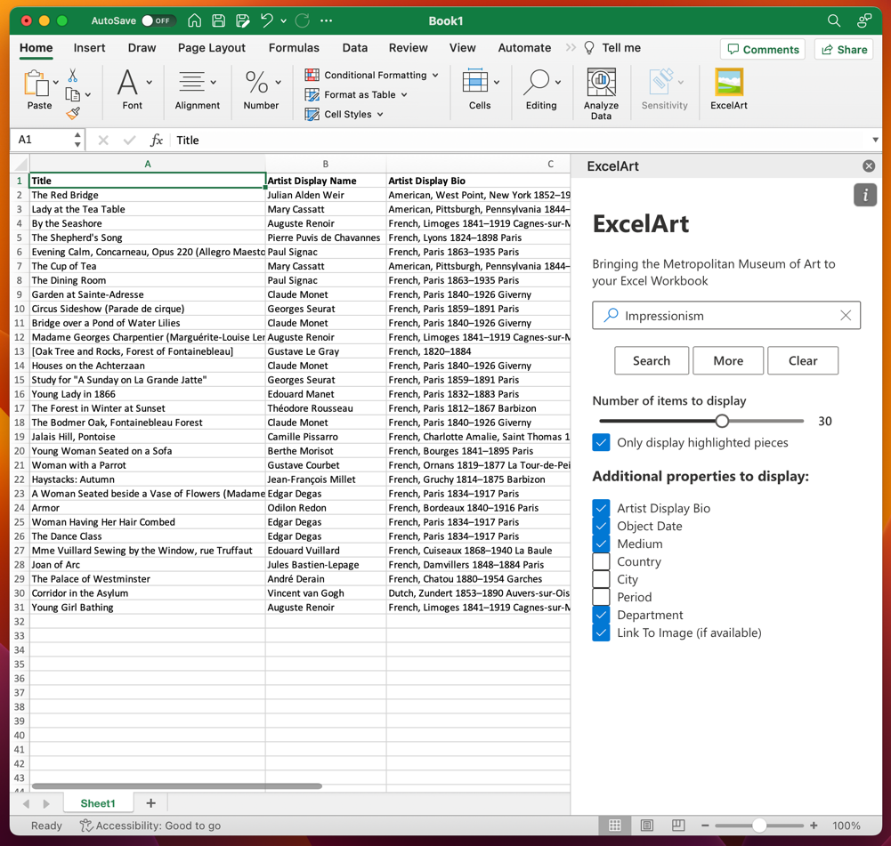

# SpreadshArt

_An Excel Add-In demo to list entries from the Metropolitan Museum of Art's open API into an Excel workbook._



## Installation

If you received a `manifest.xml` from me, that's all you need to run the application, but you'll need to follow the instructions below to sideload the add-in into Excel, depending on your platform. The manifest points to the production server hosted on `surge.sh`

You can sideload the app into Excel in any of the following ways, depending upon your chosen platform.

The instructions below could be repeated to sideload the application onto any arbitrary number of users' machines, but the easiest way to deploy organization-wide would be to use the [Microsoft 365 admin center](https://learn.microsoft.com/en-us/microsoft-365/admin/manage/manage-deployment-of-add-ins?view=o365-worldwide)

### Web

For Excel online and Office 365, sideloading an Add-In is quite simple. Just follow the instructions below to upload the manifest and enable the Add-In.

[Manually sideload an add-in to Office on the web](https://learn.microsoft.com/en-us/office/dev/add-ins/testing/sideload-office-add-ins-for-testing#manually-sideload-an-add-in-to-office-on-the-web)

### Mac

On Mac the process is slightly more complicated but still straightforward. Add the manifest file to your local file system in the `~/Library/Containers/com.microsoft.Excel/Data/Documents/wef/` directory, then select it from the dropdown in the My Add-Ins section of the Insert ribbon.

[Sideload an add-in in Office on Mac](https://learn.microsoft.com/en-us/office/dev/add-ins/testing/sideload-an-office-add-in-on-mac#sideload-an-add-in-in-office-on-mac)

### Windows

The process is the most cumbersome on Windows. Follow the instructions below:

[Sideload Office Add-ins for testing from a network share](https://learn.microsoft.com/en-us/office/dev/add-ins/testing/create-a-network-shared-folder-catalog-for-task-pane-and-content-add-ins)

You'll have to

1. Create a network share
2. Create a registry script to add the network share to the trusted catalog
3. Run the registry script on the user's machine
4. Add the manifest file to the network share
5. Add the Add-In from the network share within Excel's My Add-Ins section of the Insert ribbon.

The registry script will look like this and there's a template in the `./windows` directory.

```reg
Windows Registry Editor Version 5.00

[HKEY_CURRENT_USER\Software\Microsoft\Office\16.0\WEF\TrustedCatalogs\{-random-GUID-here-}]
"Id"="{-random-GUID-here-}"
"Url"="\\\\-share-\\-folder-"
"Flags"=dword:00000001
```

**NB: Make sure to double any `\` characters in the local URL.**

## Development

If you did not receive a manifest file, you can still run the application locally. You'll need to clone the repository and run the following commands:

```bash
npm install
npm run start
```

This should launch a local server and open Excel with the application running.

If you run into issues after `npm install` you may need to rename (or clone) `./node_modules/@fluentui/react/lib-common-js` to `./node_modules/@fluentui/react/lib` because of some longstanding issues with Microsoft's Fluent / Fabric UI versioning for Office Add-Ins.

You can also run `npm run build` to create the `./dist` folder with the output of the static app and the production manifest file for sideloading.

## Usage

You can confirm the add-in has been successfully installed by the appearance of a picture frame icon in the Home ribbon.

Once the add-in is installed you can use it by clicking the icon. This will open a task pane on the right side of the screen. You can use the search bar to search items in the Met's collection. You can search for individual artists or themes--any words that appear in the metadata will constitute a match.
The search will return a list of items that match your query. You can add more details to your search results by clicking the checkboxes and adjust the slider to change the number of results returned. You can click "More" to receive another batch of results below your current results. You can also click the "Clear" button to clear the search results, although they're automatically cleared when you start a new search.

## Details

This is very much a toy project constrained by time and the inherent limitations of a technical assessment. I've made it as robust as I think makes sense for a demo, but here are a few things I'd improve if I had more time:

- Context-unaware writing to workbook
  - Content is dumped into cells in a 'dumb' fashion, without checking to see if anything is being overwritten. This could be improved by checking for existing content and prompting the user to confirm overwriting.
  - Similarly, we're just writing to the Active worksheet, instead of either allowing the user to select a worksheet or remembering the worksheet after the first search. This also allows for overwriting and can trip up the (manual) pagination of results. This could be fixed by having the user designate a desired worksheet or just remembering the last worksheet used.
  - Stylistically, it would also be straightforward (just tedious) to style the cells according to the data, for example artwork with titles that happen to be dates are currently formatted as dates, which is probably not what the user wants. It would also be easy to resize columns to accommodate longer titles.
- Error handling
  - We're throwing errors, but the user isn't presented with any information or a graceful recovery. In the case of network interruption the user might be confused with no feedback. This could be improved by presenting a modal with an error message.
- Testing
  - I've manually tested the app in Excel Online, Excel for Mac, and Excel for Windows, but I haven't written any automated tests. This could be improved by writing unit tests for the various functions and integration tests for the app as a whole. I've broken out functions to make them easy to test but felt that time was better spent developing features.
  - Likewise, I'd like to test across more versions and platforms of Excel, which can have different JavaScript runtime environments and different performance profiles.
- Styling
  - Styling is pretty barebones and what little CSS is there is done inline, which incurs a performance penalty. Leveraging FluentUI gives it polish without too much effort, but I'd like to spend more time on it with proper and best-practices CSS.

As well as some features I considered adding but cut for time:

- Displaying the artwork within the workbook itself.
  - This functionality is actually built, but I couldn't find a graceful way to integrate it into the UI quickly. There are functions to, given an artwork, get its image representation, convert it to a Shape object and add it to the workbook.
- Caching responses
  - The Met doesn't provide full results within the initial search, only IDs for subsequent searching, so each cell represents a separate network call. This data is quite stable, so caching the results is a no-brainer to improve performance and reduce the number of network calls.
- Hyperlinking cells
  - This is straightforward, just tedious. The search results include links to the images themselves, as well as biographical data--I'd like to add hyperlinks to relevant cells where applicable.

Let me know if you have any questions or feedback!
